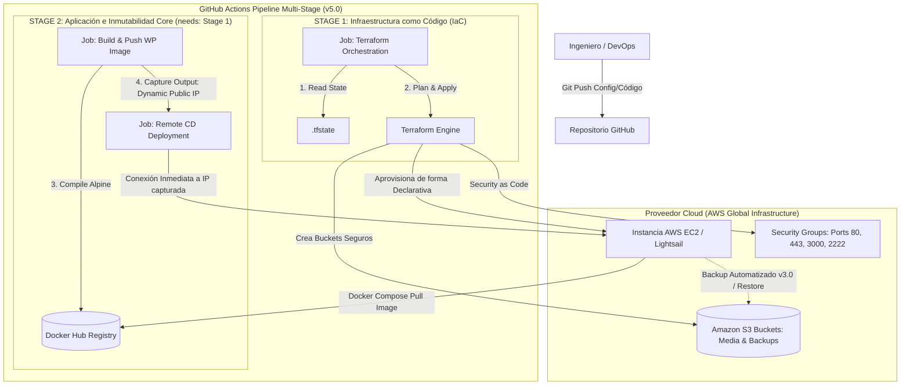

# 🚀 Del Monolito en "Caja Negra" a la Infraestructura Inmutable Automatizada con IaC y CI/CD

Bienvenido a la bitácora de ingeniería y repositorio central de mi plataforma web. Este proyecto documenta la evolución, refactorización y automatización de la infraestructura tecnológica que soporta mi práctica profesional y academia digital.

A lo largo de **5 fases evolutivas y múltiples iteraciones**, el ecosistema migró desde un entorno tradicional limitado hacia un stack moderno de nivel empresarial, guiado por los pilares de **Fiabilidad, Seguridad, Eficiencia de Rendimiento y Optimización de Costos** del *AWS Well-Architected Framework*.

---

## 📖 El Storytelling de la Arquitectura: ¿Por qué este proyecto?

### 🔴 El Origen: La Vulnerabilidad del Hosting Tradicional

En el ámbito de la salud y la formación, la experiencia del usuario (UX) es un factor crítico de negocio. El momento en que un paciente decide buscar ayuda es de alta vulnerabilidad; si la plataforma experimenta lentitud, errores de conexión o caídas, la confianza se rompe de inmediato.

Originalmente, la plataforma (una landing page dinámica en WordPress) se encontraba delegada en un servicio de hosting tercerizado. Esta solución presentaba serias limitaciones operativas:

* **Falta de visibilidad:** Actuaba como una "caja negra" sin métricas de rendimiento reales.
* **Rigidez absoluta:** Imposibilidad de modificar configuraciones del sistema operativo o del servidor web para mitigar picos de tráfico.
* **Riesgo de continuidad:** Dependencia de respaldos manuales opacos y nula tolerancia a fallos ante la concurrencia simultánea (por ejemplo, al enviar un correo masivo a 500 alumnos para el lanzamiento de un taller).

### 🟡 El Viaje: Evolución por Hitos Técnicos

Para recuperar la soberanía tecnológica y garantizar la "paz mental", se diseñó un plan de transformación digital ejecutado en cinco grandes etapas:

1. **Fase 1 (Contenedores y Hardening):** El primer paso fue aislar la aplicación mediante Docker para asegurar su portabilidad y migrarla a una instancia controlada en la nube de AWS. Inmediatamente se aplicaron políticas estrictas de DevSecOps: se deshabilitó el acceso SSH por contraseña, se implementó un puerto seguro alternativo (2222) y se configuró `Fail2Ban` para repeler ataques perimetrales de fuerza bruta.
2. **Fase 2 (La Inmutabilidad del Core):** Pasar de despliegues manuales imperativos a pipelines automatizados con GitHub Actions. El hito mayor aquí fue rediseñar el contenedor para que fuera un **Núcleo Inmutable**, compilando imágenes ligeras basadas en PHP Alpine en los runners de GitHub y distribuyéndolas vía Docker Hub. El tiempo de inactividad durante una actualización bajó a un micro-corte imperceptible de 2 a 5 segundos.
3. **Fase 3 (Resiliencia Aislada):** Se construyó un motor de respaldos desatendido. Un contenedor dedicado ejecuta tareas programadas (`cron`) para comprimir la base de datos y los activos de negocio (`wp-content`), sincronizándolos de forma segura en buckets de Amazon S3, aislando este proceso del runtime principal para no degradar la navegación de los usuarios.
4. **Fase 4 (Observabilidad Proactiva):** Implementación de telemetría en tiempo real mediante Prometheus y Grafana. El sistema pasó de ser reactivo a proactivo, alertando mediante consultas lógicas en PromQL sobre la salud del hardware y el estado del motor de base de datos antes de que un usuario experimente una falla.

### 🟢 El Destino Actual: El Proyecto Nace con un Solo Comando

Hoy, en la **Fase 5**, el proyecto ha alcanzado su madurez absoluta mediante la adopción de **Infraestructura como Código (IaC) con Terraform**. Toda la topología de la nube de AWS (cómputo, almacenamiento S3, políticas de red y Security Groups restrictivos) está completamente codificada.

Gracias a un pipeline multi-etapa unificado, el entorno completo puede destruirse y recrearse desde cero de forma idéntica, transparente y predecible en minutos, garantizando una resiliencia total y una tolerancia extrema a desastres.

---

## 🛠️ Stack Tecnológico Global

* **Core Applications:** WordPress (PHP-FPM Alpine), Nginx (Reverse Proxy & SSL Let's Encrypt), MySQL Server.
* **Containerization & Orquestation:** Docker, Docker Compose, Docker Hub Registry.
* **Cloud Infrastructure (AWS):** Amazon EC2 / Lightsail, Amazon S3 (Object Storage).
* **Infrastructure as Code (IaC):** Terraform.
* **CI/CD Automation:** GitHub Actions (Multi-stage Pipelines, Context & Secret Management).
* **Observability & Telemetry:** Prometheus, Grafana, Node Exporter, MySQL Server Exporter.
* **Host Hardening:** UFW Firewall, Fail2Ban, SSH Criptográfico (Ed25519).

---

## 🗺️ Arquitectura de la Infraestructura Final (v5.0)

El siguiente diagrama representa el ecosistema unificado actual. Muestra cómo conviven de forma aislada el pipeline de infraestructura (IaC) y el pipeline de entrega de software (CI/CD), convergiendo de forma segura sobre la arquitectura en la nube de AWS.

---

## ⚖️ Decisiones Estratégicas y Filosofía FinOps

Dado que la plataforma se autosolventa, se priorizó un enfoque de **Ingeniería Pragmática** y optimización financiera:

* **Escalado Vertical Manual**: En lugar de mantener costosos balanceadores de carga y reglas de auto-escalado dinámico ociosas, ante un evento de alta concurrencia programado se aplica una estrategia de dimensionamiento manual justo (*right-sizing*). Se incrementan los recursos de la instancia en la consola de AWS temporalmente y se reducen al finalizar el evento, conteniendo los costos fijos mensuales al mínimo.
* **RPO y RTO Robustos**: Ante la caída crítica del hardware físico de la zona de disponibilidad de AWS, el tiempo de recuperación (RTO) se reduce a lo que tarda el pipeline automatizado en ejecutar el plan de Terraform y restaurar los dumps de datos dinámicos desde S3.

---

## 📂 Estructura de Documentación del Repositorio

Para auditar en profundidad el histórico técnico, las justificaciones de diseño y el comportamiento detallado de cada versión, revisá los siguientes directorios integrados exclusivamente en esta rama final:

* **docs/fases-anteriores/**: Contiene la bitácora técnica descriptiva y los diagramas de arquitectura específicos de cada versión previa (`v1.0` a `v5.0`), permitiendo analizar cómo mutó el código.
* **adr/**: Directorio de *Architecture Decision Records*. Registros formales e inmutables que detallan el contexto, las deudas técnicas asumidas y los motivos de negocio detrás de cada gran elección tecnológica.
