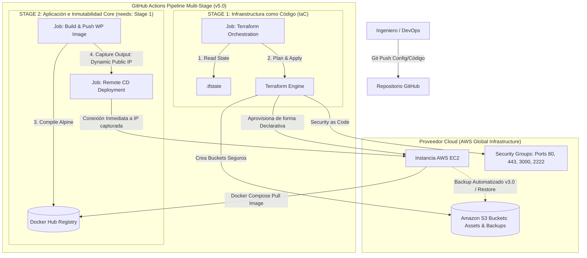

# 🚀 Del Monolito en "Caja Negra" a la Infraestructura Inmutable Automatizada con IaC y CI/CD

Bienvenido a la bitácora de ingeniería y repositorio central de mi plataforma web profesional. Este proyecto documenta la evolución, refactorización y automatización de la infraestructura tecnológica que soporta mi práctica terapéutica y academia digital a nivel global.

A lo largo de **5 fases evolutivas y múltiples iteraciones**, el ecosistema migró desde un entorno tradicional limitado hacia un stack moderno de nivel empresarial, guiado por los pilares de **Fiabilidad, Seguridad, Excelencia Operativa y Optimización de Costos (FinOps)** del *AWS Well-Architected Framework*.

---

## 📖 El Storytelling de la Arquitectura: ¿Por qué este proyecto?

### 🔴 El Origen: La Vulnerabilidad del Hosting Tradicional

En el ámbito de la salud y la formación, la experiencia del usuario (UX) es un factor crítico de negocio. El momento en que un paciente decide buscar ayuda es de alta vulnerabilidad; si la plataforma experimenta lentitud, errores de conexión o caídas, la confianza y la reputación de la marca se rompen de inmediato.

Originalmente, la plataforma (una landing page dinámica en WordPress) se encontraba delegada en un servicio de hosting compartido tercerizado. Esta solución operaba como una "caja negra" y presentaba serias limitaciones y riesgos que afectaban mi negocio:

* **Falta de Resiliencia Real (El problema del vecino):** Si otra página web alojada en el mismo servidor sufría un ataque o un pico de tráfico, mi web de terapia se caía o se ralentizaba de forma impredecible.
* **Actualizaciones con Caídas (Downtime inevitable):** Depender de herramientas manuales (como FTP) o del panel de cPanel para actualizar plugins o cambiar código implicaba que, ante cualquier falla en la base de datos, la web quedaba rota o en "Pantalla de Mantenimiento" por horas.
* **Rigidez e Inseguridad:** Imposibilidad de modificar configuraciones profundas del sistema operativo y ausencia de backups avanzados automáticos y encriptados fuera del hosting, poniendo en riesgo la integridad de los datos de salud.

### 🟡 El Viaje: Evolución por Hitos Técnicos

Para recuperar la soberanía tecnológica, garantizar la "paz mental" y asegurar la continuidad del negocio, se diseñó un plan de transformación digital ejecutado en cinco grandes etapas:

1. **Fase 1 (Contenedores, Aislamiento y Hardening - v1.0 a v1.2):** El primer paso consistió en contenerizar el stack (WordPress, Nginx, MySQL, wp-cli, phpMyAdmin) para asegurar portabilidad absoluta e inyectar configuraciones dinámicas basadas en variables de entorno (`.env`). Se migró la aplicación a una instancia dedicada de AWS bajo el SO Linux (elegido por su eficiencia de recursos y TCO cero). Inmediatamente se aplicaron políticas estrictas de DevSecOps sobre el Host: mudanza del puerto SSH al seguro 2222, deshabilitación absoluta del login de root, bloqueo de autenticación por contraseña para forzar llaves criptográficas, aislamiento perimetral mediante firewall UFW y despliegue del demonio `Fail2Ban` para mitigar ataques de fuerza bruta.
2. **Fase 2 (La Inmutabilidad del Core y Automatización de Despliegues - v2.0 a v2.1):** Pasamos de despliegues manuales a un flujo automatizado de CI/CD con GitHub Actions. Rediseñamos la arquitectura bajo el enfoque de **Núcleo Inmutable**, abstrayendo el directorio dinámico `/wp-content` fuera del proceso de compilación. Las imágenes personalizadas ligeras se compilan en un entorno PHP-FPM Alpine dentro de los runners de GitHub, se etiquetan con el Commit SHA único de Git para trazabilidad criptográfica y se publican en Docker Hub. El despliegue continuo (CD) en el servidor de producción de AWS se optimizó eliminando tareas pesadas de compilación local y limitándose a ejecutar un comando inmediato de descarga (`docker compose pull`). El downtime durante una actualización se redujo a un micro-corte imperceptible de 2 a 5 segundos.
3. **Fase 3 (Resiliencia Aislada y Recuperación ante Desastres - v3.0):** Se construyó un motor de respaldos desatendido, cíclico y tolerante a fallos. Extendimos la arquitectura incorporando un microservicio sidecar dedicado (`backup-service`) en Docker Compose. Este contenedor, gobernado por scripts defensivos en Bash (`set -e`) y calendarizado de forma desatendida mediante `cron`, extrae los dumps de la base de datos en caliente y empaqueta recursivamente los activos mutables (`wp-content`). Utilizando el CLI de AWS, transporta de forma automatizada los artefactos comprimidos hacia un búnker digital seguro en Amazon S3 (`us-east-1`), garantizando una durabilidad del 99.999999999% y un RPO de máximo 24 horas sin interferir con el runtime de la aplicación.
4. **Fase 4 (Observabilidad Proactiva y Telemetría - v4.0):** Implementación de una capa transversal de monitoreo en tiempo real mediante un patrón de recolección por raspado (*pulling*). Desplegamos Prometheus y Grafana de forma aislada en redes internas de Docker, limitando el perímetro exterior y exponiendo únicamente el puerto `:3000`. Instrumentamos métricas de hardware del host mediante `Node Exporter` y variables de rendimiento de la base de datos a través de `MySQL Server Exporter` con un usuario de mínimo privilegio. Diseñamos ingeniería de alertas mediante consultas matemáticas escritas en PromQL (como la regla booleana `mysql_up == 0`). El sistema mutó de reactivo a proactivo, alertando anomalías de forma automatizada e inmediata directo a mis paneles de control antes de que impacte en la disponibilidad del alumno o paciente.

### 🟢 El Destino Actual: El Proyecto Nace con un Solo Comando

Hoy, en la **Fase 5 (v5.0)**, el proyecto ha alcanzado su madurez absoluta mediante la adopción de **Infraestructura como Código (IaC) con Terraform** y la orquestación multi-etapa en pipelines.

Toda la topología cloud global de AWS (instancias EC2, políticas de S3, redes lógicas y Security Groups declarados restrictivamente por código) está completamente automatizada. Gracias a la directiva lógica `needs` en GitHub Actions, el Stage 1 (IaC) valida y aplica los cambios de Terraform de forma desatendida; si finaliza con éxito, el Stage 2 (Aplicación) captura en caliente la IP pública dinámica exportada de la nueva instancia EC2 para transferirla al runner encargado del despliegue del software.

Se logró un aislamiento estricto entre ciclos de vida: las actualizaciones de código (temas de WordPress o entrypoints) agilizan el pipeline ejecutando el CD directamente sobre el servidor existente sin forzar la recreación del hardware de AWS si Terraform detecta que el estado de la nube permanece intacto. El entorno completo puede reconstruirse, clonarse o destruirse por completo (`terraform destroy`) en minutos con un solo comando, garantizando resiliencia total (RTO mínimo) y optimización financiera absoluta.

---

## 🛠️ Stack Tecnológico Global

* **Core Applications:** WordPress (PHP-FPM Alpine), Nginx (Reverse Proxy & SSL Let's Encrypt), MySQL Server.
* **Containerization & Orchestration:** Docker, Docker Compose, Docker Hub Registry.
* **Cloud Infrastructure (AWS):** Amazon EC2, Amazon S3 (Object Storage).
* **Infrastructure as Code (IaC):** Terraform.
* **CI/CD Automation:** GitHub Actions (Multi-stage Pipelines, Context & Secret Management).
* **Observability & Telemetry:** Prometheus, Grafana, Node Exporter, MySQL Server Exporter.
* **Host Hardening:** UFW Firewall, Fail2Ban, SSH Criptográfico (Ed25519), Directivas de seguridad en Docker y WordPress (`DISALLOW_FILE_EDIT`).

---

## 🗺️ Arquitectura de la Infraestructura Final (v5.0)

El siguiente diagrama representa el ecosistema unificado actual. Muestra cómo conviven de forma aislada el pipeline de infraestructura (IaC) y el pipeline de entrega de software (CI/CD), convergiendo de forma segura sobre la arquitectura en la nube de AWS.

---

## ⚖️ Decisiones Estratégicas y Filosofía FinOps

Dado que la plataforma se autosolventa, se priorizó un enfoque de **Ingeniería Pragmática** y optimización financiera drástica para mantener el costo mensual en el mínimo viable:

* **Estrategia Single-Instance vs Alta Disponibilidad Multi-Nodo**: En lugar de pagar una fortuna ociosa el 95% del tiempo por balanceadores de carga nativos y múltiples nodos distribuidos, se centralizó el cómputo en una única instancia optimizada mediante técnicas avanzadas de derecho de dimensionamiento (*right-sizing*).
* **Mitigación de Concurrencia en Lanzamientos**: Para soportar picos masivos de tráfico (como el lanzamiento coordinado de un taller hacia cientos de alumnos), se rechaza el auto-escalado dinámico costoso y se aplica FinOps manual: se levanta un entorno de pruebas idéntico o se modifican los recursos de la instancia en un par de clics desde la consola de AWS de forma controlada antes del evento, devolviendo el hardware a su tamaño económico base (t3.micro/nano) al finalizar.
* **RPO y RTO Robustos alineados al Negocio**: Ante un fallo catastrófico o la caída física de la zona de disponibilidad de AWS, el tiempo de recuperación del negocio (RTO) se reduce al mínimo que tarda el pipeline automatizado en reaprovisionar el hardware limpio con Terraform e inyectar el código y los datos históricos descargados de S3 a través del comando `make restore-s3`.

---

## 📂 Estructura de Documentación del Repositorio

Para auditar en profundidad el histórico técnico, las justificaciones de diseño y el comportamiento detallado de cada versión, revisá los siguientes directorios integrados exclusivamente en esta rama final:

* **docs/fases-anteriores/**: Contiene la bitácora técnica descriptiva y los diagramas de arquitectura específicos de cada versión previa (`v1.0` a `v5.0`), permitiendo analizar cómo mutó y se refactorizó el código.
* **adr/**: Directorio de *Architecture Decision Records*. Registros formales, ordenados e inmutables (ADR 0001 a ADR 0005) que detallan el contexto, las consecuencias técnicas asumidas y los motivos de negocio detrás de cada gran elección tecnológica de este stack.
