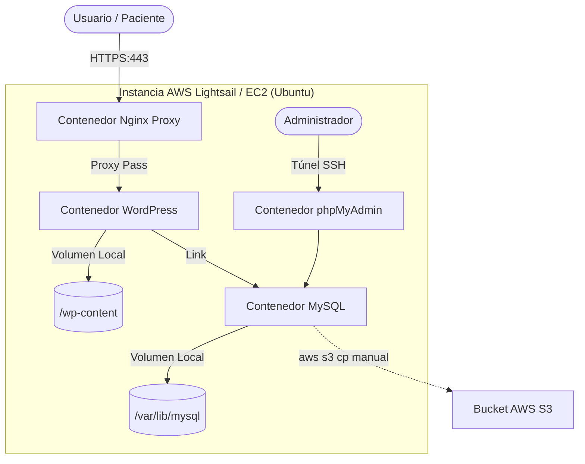

# Fase 1: Despliegue de Aplicación WordPress en AWS con Docker

## Versión v1.0 — Functional Cloud Deployment (MVP)

### Contexto Técnico y Objetivos

El punto de partida del proyecto se centró en el "Time-to-Market" y en obtener soberanía absoluta sobre la administración del stack tecnológico. Se diseñó un enfoque de monolito desacoplado en la nube para migrar una aplicación WordPress real alojada en un hosting tradicional tipo "caja negra", el cual limitaba el control operativo y ponía en riesgo la continuidad del negocio ante picos de tráfico.

La prioridad en esta versión fue contenerizar la aplicación para garantizar la portabilidad y resolver la persistencia básica de datos.

### Soluciones e Infraestructura Implementada

* **Contenedores Base:** Escritura del archivo `docker-compose.yml` inicial acoplando de forma coordinada los servicios de `wordpress`, `nginx`, `mysql`, `wp-cli` y `phpMyAdmin`.
* **Persistencia Local:** Configuración de volúmenes Docker locales para asegurar el resguardo de la base de datos MySQL y el directorio dinámico `wp-content`.
* **Aprovisionamiento Ligero:** Creación de un script de bootstrap (`bootstrap.sh`) para automatizar la instalación de Docker y Docker Compose en una instancia limpia de Ubuntu ejecutada en AWS Lightsail.
* **Abstracción de Comandos:** Implementación de un `Makefile` operativo para unificar comandos lógicos de administración (`make up`, `make down`, `make restart`).
* **Seguridad y Recuperación Inicial:** Cifrado en tránsito (HTTPS) mediante la automatización de certificados SSL emitidos por Let's Encrypt (`make ssl-init`) y diseño de una estrategia manual de Disaster Recovery utilizando comandos CLI de AWS (`aws s3 cp`) para respaldar dumps de SQL en un bucket de Amazon S3.

### Diagrama de Arquitectura (v1.0)

