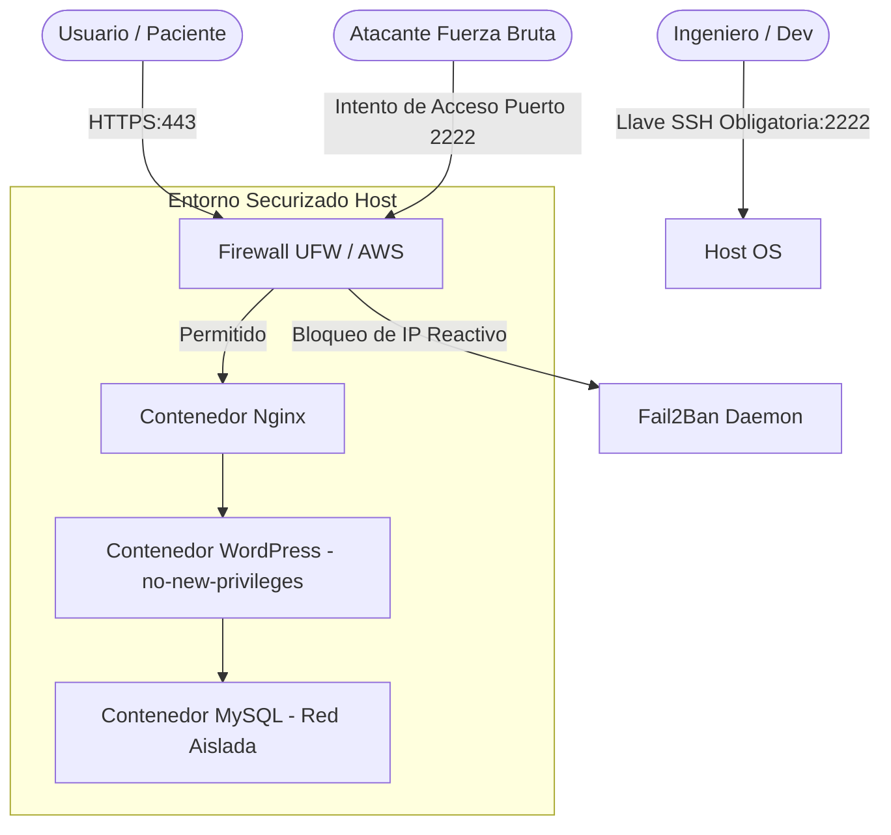

# Fase 1: Despliegue de Aplicación WordPress en AWS con Docker

## Versión v1.1 — Security, Hardening & Integration Stability

### Contexto Técnico y Objetivos

Con el entorno base estabilizado en la nube, el foco mutó drásticamente hacia la seguridad defensiva (DevSecOps) y la protección ética de la información. Al tratarse de una plataforma que gestiona datos sensibles y registros confidenciales, se hacía imperativo blindar el perímetro del servidor contra ataques automatizados de fuerza bruta y limitar los privilegios internos del ecosistema de contenedores.

### Soluciones e Infraestructura Implementada

* **Hardening del Host:** Modificación manual del puerto SSH por defecto del estándar 22 al puerto seguro 2222, deshabilitación estricta del login de `root` y eliminación de la autenticación por contraseña para forzar el uso exclusivo de llaves criptográficas.
* **Seguridad Perimetral:** Configuración restrictiva de las reglas del firewall nativo del host (UFW) en concordancia con el panel de seguridad de AWS.
* **Mitigación de Fuerza Bruta:** Instalación y puesta en marcha del demonio `Fail2Ban`, configurando jaulas (jails) activas orientadas a bloquear de forma reactiva IPs maliciosas que atacaran el puerto 2222.
* **Aislamiento en Contenedores:** Inyección de banderas de restricción de privilegios (`no-new-privileges:true`), montaje de sistemas de archivos temporales en memoria RAM (`tmpfs`), y aislamiento de redes lógicas para que `phpMyAdmin` solo sea accesible mediante túneles en localhost.
* **Defensa de Aplicación:** Ajuste defensivo de las directivas internas de WordPress aplicando la constante `DISALLOW_FILE_EDIT` para bloquear la edición de código fuente desde el panel de administración web.
* **Hotfix v1.1.2:** Inyección del bloque de variables de entorno en el servicio `wp-cli`, corrigiendo fallas de conexión al invocar comandos de CLI sin contexto.

### Diagrama de Arquitectura (v1.1)

