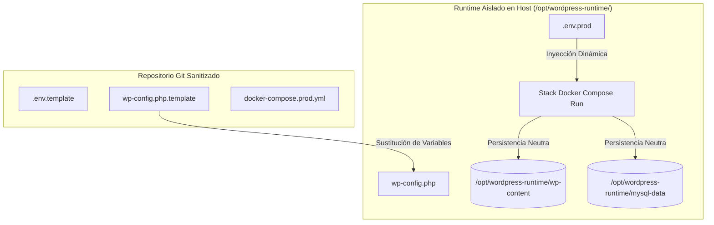

# Fase 1: Despliegue de Aplicación WordPress en AWS con Docker

## Versión v1.2 — Environment Decoupling & Full Automation

### Contexto Técnico y Objetivos

Esta versión representó el cierre de la primera gran fase de contenedorización. El objetivo fue limpiar por completo el repositorio de código, eliminar el acoplamiento duro de configuraciones y estructurar el proyecto bajo estándares profesionales de desarrollo (DX), preparando la infraestructura para soportar entornos locales (Desarrollo) y remotos (Producción) de forma transparente y agnóstica.

### Soluciones e Infraestructura Implementada

* **Desacoplamiento Absoluto de la Capa de Datos:** Migración y abstracción del almacenamiento dinámico de WordPress (`wp-content`) y el motor de persistencia de MySQL fuera del directorio raíz del repositorio de código hacia la ruta neutra absoluta del host `/opt/wordpress-runtime/`.
* **Arranque Dinámico:** Reemplazo del archivo estático `wp-config.php` por un sistema basado en la plantilla `wp-config.php.template` que genera el archivo de runtime fusionando variables del entorno (`.env`) al vuelo.
* **Control de Orquestación y Disponibilidad:** Incorporación de directivas de `healthcheck` nativas en Docker Compose, forzando políticas de inicio ordenado para evitar condiciones de carrera (impediendo que PHP-FPM inicie antes de que la base de datos acepte conexiones).
* **Segmentación Multi-entorno:** División explícita de archivos de configuración dedicados para desarrollo local y producción (`.env.local` / `.env.prod` y `docker-compose.local.yml` / `docker-compose.prod.yml`).
* **Maduración de Scripts:** Creación de macros avanzadas en el `Makefile` (`make full-deploy`), permitiendo gatillar de forma secuencial y automatizada el bootstrap, la descarga desde S3 y la inyección SQL en un solo comando.
* **Sanitización Estricta (v1.2.2/v1.2.3):** Remoción profunda del repositorio público de secretos, credenciales, IPs públicas y dominios personales para garantizar la portabilidad absoluta del código hacia portafolios profesionales.

### Diagrama de Arquitectura (v1.2)

