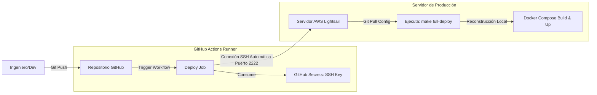

# Fase 2: Pipeline CI/CD para WordPress basado en Docker

## Versión v2.0 — Automated Remote Deployment (Línea Base de CD)

### Contexto Técnico y Objetivos

Con una arquitectura base desacoplada y limpia, la intervención manual imperativa en el servidor vía SSH representaba un riesgo latente para la estabilidad y una ineficiencia operativa. El objetivo de la versión v2.0 fue establecer los cimientos de Despliegue Continuo (CD) para automatizar el transporte de configuraciones y actualizaciones de infraestructura hacia AWS, eliminando los despliegues manuales "a mano".

### Soluciones e Infraestructura Implementada

* **Workflow Base de Automatización:** Diseño y escritura del flujo de automatización en GitHub Actions mediante el archivo `.github/workflows/deploy.yml`, configurando disparadores automáticos ante eventos de `push` en las ramas principales (`main` y `dev`).
* **Seguridad en Pipelines:** Gestión e integración segura de secretos de conectividad mediante *GitHub Secrets*, encapsulando llaves SSH privadas para interactuar con la instancia de AWS de forma desatendida sin exponer credenciales en el código fuente.
* **Pipeline de Transporte Remoto:** Desarrollo de tareas lógicas encargadas de realizar la conexión automática hacia el host de AWS, clonar/sincronizar los archivos de configuración del repositorio en destino y ejecutar comandos operativos remotos a través del `Makefile`.
* **Orquestación del Ciclo de Vida Remoto:** Automatización del refresco del stack en el servidor de producción (`docker-compose build --no-cache` y `up -d`) inmediatamente después de recibir las actualizaciones del repositorio, reduciendo drásticamente el error humano.

### Diagrama de Arquitectura (v2.0)

