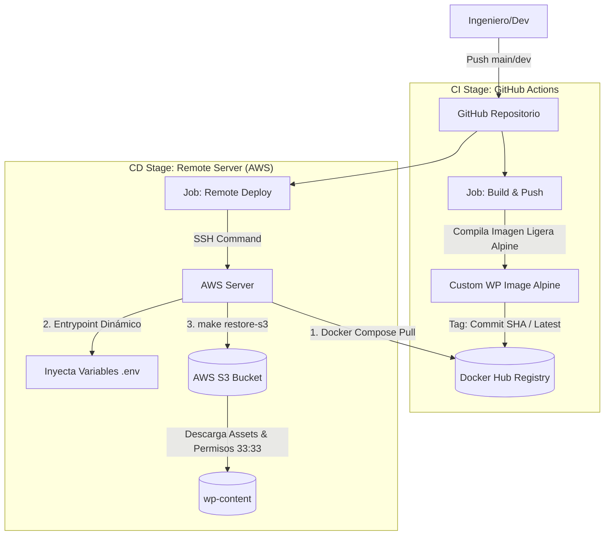

# Fase 2: Pipeline CI/CD para WordPress basado en Docker

## Versión v2.1 — Enterprise CI/CD Pipeline & Immutable Core (Hito Mayor)

### Contexto Técnico y Objetivos

A pesar de contar con despliegue remoto automatizado, la versión 2.0 obligaba al servidor de producción a realizar tareas pesadas de compilación (`build`), consumiendo CPU y memoria de la instancia en runtime, comprometiendo la experiencia del usuario (UX) durante las actualizaciones. Esta versión rediseñó por completo el flujo bajo el paradigma de **Núcleo Inmutable**, migrando la compilación hacia los runners de GitHub y distribuyendo imágenes precompiladas.

### Soluciones e Infraestructura Implementada

* **Diseño de Núcleo Inmutable:** Desacoplamiento estricto de la imagen Docker de WordPress, abstrayendo por completo el directorio dinámico `wp-content` fuera del proceso de compilación para que la imagen empaquete únicamente código estático agnóstico.
* **Etapa de Integración Continua (CI):** Automatización de la compilación de la imagen personalizada de WordPress utilizando un entorno ligero basado en `PHP-FPM Alpine` para mitigar el consumo latente de memoria y optimizar el peso del artefacto.
* **Control de Versiones Criptográfico:** Autenticación segura en Docker Hub vía secrets y automatización del etiquetado (*tagging*) utilizando la combinación del identificador de última versión (`latest`) con el `Commit SHA` único de Git para asegurar la trazabilidad absoluta del código.
* **CD de Nivel Enterprise:** Eliminación definitiva de tareas de compilación dentro de la instancia de AWS mediante la sustitución del build local por un comando inmediato de descarga (`docker compose pull`) de la imagen inmutable precompilada. El micro-corte se redujo a solo lo que tarda el contenedor en reiniciarse (2 a 5 segundos).
* **Entrypoint Dinámico Personalizado:** Despliegue de un script (`docker-entrypoint-custom.sh`) que utiliza `envsubst` para procesar plantillas e inyectar variables de entorno en caliente al inicializar el contenedor.
* **Automatización en Runtime:** Integración en el flujo de arranque de llamadas automáticas hacia el comando `make restore-s3` para descargar y asignar permisos Unix específicos de la infraestructura (`33:33`) a los datos históricos en AWS S3.

### Diagrama de Arquitectura (v2.1)

