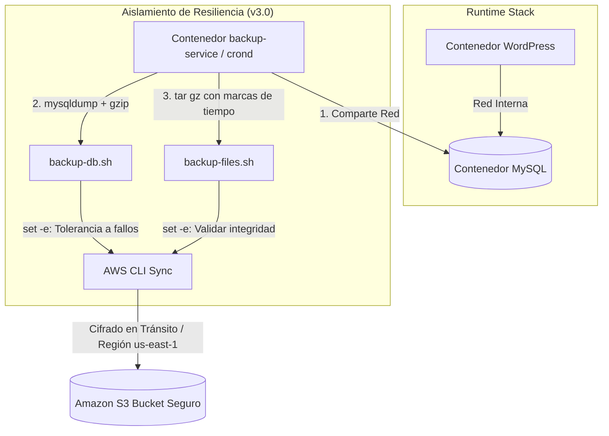

# Fase 3: Automatización de Backups de Aplicación Web con AWS S3

## Versión v3.0 — Automated Cloud Backup Engine & Disaster Recovery

### Contexto Técnico y Objetivos

Bajo los pilares de Fiabilidad y Resiliencia del *AWS Well-Architected Framework*, la pérdida de información confidencial, historiales de pacientes o registros financieros representa una catástrofe inaceptable. El objetivo estratégico de esta fase fue diseñar e integrar un motor de respaldos automatizado, cíclico y tolerante a fallos, aislando por completo los procesos de copia de seguridad del runtime principal de la aplicación para no degradar el rendimiento del usuario.

### Soluciones e Infraestructura Implementada

* **Aislamiento de Infraestructura de Resiliencia:** Extensión y configuración de un servicio independiente (`backup-service`) en el archivo `docker-compose.prod.yml`, permitiendo que comparta la red lógica interna con el motor de la base de datos (`mysql`) pero aislando por completo sus procesos del contenedor de WordPress.
* **Principio de Mínimo Privilegio:** Inyección restrictiva de credenciales y llaves criptográficas de AWS (`S3 Keys`) exclusivamente dentro del contenedor de backups mediante variables de entorno protegidas en `.env.prod`.
* **Scripting Defensivo de Datos (`backup-db.sh`):** Automatización de `mysqldump` para extraer la base de datos de WordPress de forma consistente, programando su compresión avanzada (`gzip`) e integrando marcas de tiempo dinámicas para evitar colisiones.
* **Scripting de Activos de Negocio (`backup-files.sh`):** Codificación de tareas automatizadas encargadas de empaquetar de forma recursiva los directorios de persistencia local (`wp-content`), resguardando temas, plugins y archivos multimedia en archivos `.tar.gz`.
* **Tolerancia a Fallos Estricta:** Implementación de la directiva `set -e` al inicio de todos los scripts en Bash, forzando la cancelación inmediata del proceso ante cualquier fallo de red para impedir la subida de archivos vacíos o corruptos a la nube.
* **Runtime Desatendido:** Inicialización y calendarización del demonio de tareas `cron` (`crond`) dentro del contenedor dedicado, definiendo intervalos cronológicos fijos para la ejecución cíclica de los scripts.
* **Sincronización Cloud Eficiente:** Integración del CLI de AWS (`aws s3 sync`) dentro del flujo operativo del contenedor para realizar la subida automática hacia el bucket seguro de Amazon S3 en la región `us-east-1`.
* **Estrategia de Despliegue Controlado:** Uso de Git-Flow aislando la lógica completa de resiliencia en una rama de características (*feature branch*), validando localmente (`ENV=local`) y auditando en producción mediante `make logs ENV=prod`.

### Diagrama de Arquitectura (v3.0)

