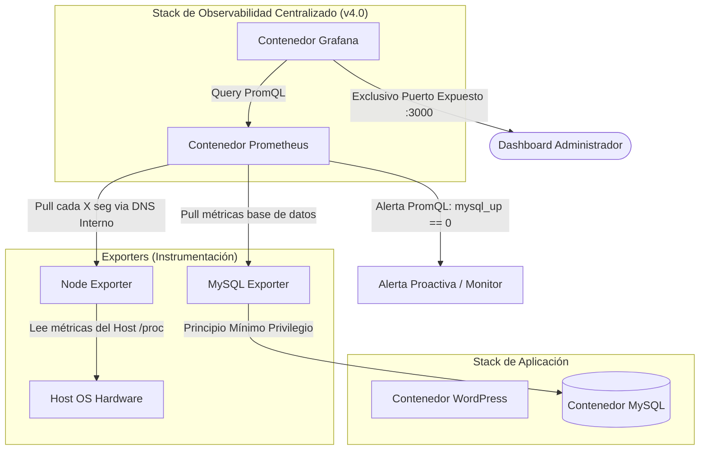

# Fase 4: Observabilidad Básica para Aplicación Docker con Prometheus y Grafana

## Versión v4.0 — Full Observability Stack & Proactive Alerting Engine

### Contexto Técnico y Objetivos

Para garantizar una experiencia de usuario premium y cumplir con el requisito de "Saber si algo no funciona antes de que avise un usuario", la plataforma requería pasar de una administración reactiva a una gestión proactiva. El objetivo estratégico de esta fase fue diseñar e integrar una solución centralizada de observabilidad en tiempo real y telemetría basada en el patrón de recolección por raspado (*pulling*), permitiendo auditar la salud del hardware y de la base de datos de manera constante.

### Soluciones e Infraestructura Implementada

* **Aprovisionamiento del Stack de Monitoreo:** Inclusión parametrizada de los servicios centralizados de Prometheus (motor de series temporales) y Grafana (capa de visualización avanzada) dentro de la orquestación del archivo `docker-compose.prod.yml`.
* **Aislamiento de Red y Service Discovery:** Configuración de redes internas lógicas dentro de Docker para permitir que Prometheus descubra dinámicamente los objetivos de métricas (*targets*) mediante DNS interno, restringiendo el perímetro exterior al exponer públicamente de forma exclusiva el puerto de visualización de Grafana (`:3000`).
* **Instrumentación del Host (Infraestructura):** Despliegue del agente `Node Exporter`, configurando volúmenes montados en modo estricto de lectura sobre los directorios del sistema de archivos del host de AWS para capturar métricas base de hardware (CPU, RAM, I/O de disco y red).
* **Instrumentación de la Capa de Persistencia:** Interconexión del contenedor `MySQL Server Exporter`, aplicando el principio de mínimo privilegio mediante un usuario de base de datos dedicado con permisos limitados de lectura a tablas de estado (extrae queries por segundo, conexiones activas e hilos).
* **Diseño de la Lógica de Raspado:** Configuración del archivo centralizado `prometheus.yml`, estableciendo los bloques `scrape_configs`, intervalos periódicos de recolección de datos e inyección de etiquetas estáticas para segmentar métricas por entorno.
* **Visualización Avanzada e Ingeniería de Alertas:** Vinculación de Prometheus como fuente de datos nativa en Grafana, importación de tableros de control profesionales (ID 1860 para Linux e ID 14057 para MySQL) y escritura de consultas lógicas en **PromQL** para alertar sobre umbrales críticos de producción (CPU superior al 90%, RAM crítica o caída del servicio mediante la métrica booleana `mysql_up == 0`).
* **Auditoría de Carga:** Simulación manual de fallas lógicas mediante apagados controlados de contenedores para validar la activación correcta de los disparadores (*triggers*) en el panel de control.

### Diagrama de Arquitectura (v4.0)

