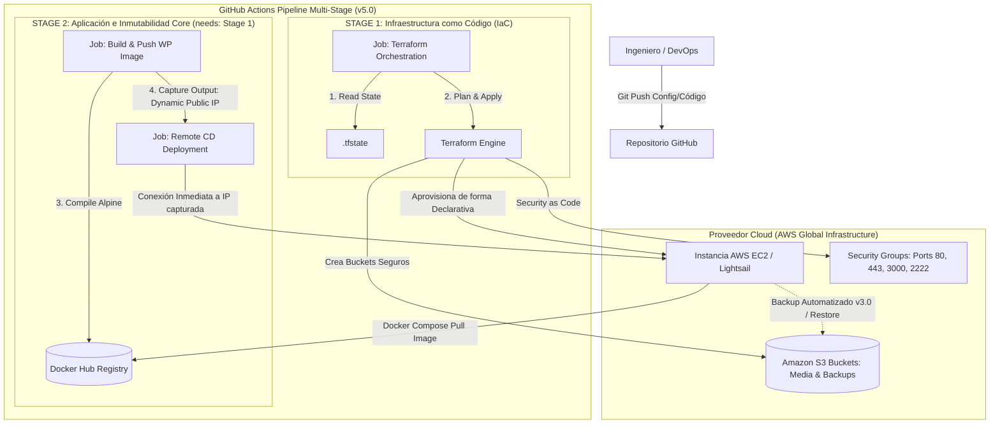

# Fase 5: El Proyecto se Crea Desde Cero con un Solo `terraform apply`

## Versión v5.0 — Infrastructure as Code & Multi-Stage Orchestration (Cierre del Stack)

### Contexto Técnico y Objetivos

Esta fase representa la madurez absoluta de la ingeniería del proyecto y el cierre evolutivo del stack. Para eliminar por completo el aprovisionamiento manual e imperativo de hardware (que genera configuraciones desviadas y dificulta la replicación ante desastres), se procedió a codificar, modularizar y automatizar el ciclo de vida global de la infraestructura en AWS utilizando el paradigma de **Infraestructura como Código (IaC)** con Terraform, unificando el control del hardware y el software en un pipeline multi-etapa totalmente automatizado.

### Soluciones e Infraestructura Implementada

* **Modelado de Arquitectura Cloud Declarativa:** Diseño y escritura de la topología global mediante archivos de configuración de Terraform (`main.tf`, `variables.tf`, `outputs.tf`) para aprovisionar de forma automática recursos de cómputo en AWS (instancias EC2) y almacenamiento de objetos (`buckets` de Amazon S3 para assets multimedia y backups).
* **Security as Code (Seguridad Perimetral):** Definición explícita de reglas de firewall mediante la declaración de recursos de *Security Groups* de AWS en código, bloqueando por defecto todo el tráfico entrante de la instancia y abriendo de forma restrictiva únicamente los puertos esenciales (`:80`, `:443`, `:3000` para Grafana y el acceso SSH securizado).
* **Gestión de Estados e Inmutabilidad:** Configuración y mantenimiento del archivo de estado de Terraform (`.tfstate`) para asegurar un comportamiento previsible de la infraestructura mediante planes de ejecución (`terraform plan`), garantizando que los recursos de hardware sean completamente reproducibles.
* **Pipeline Multi-Stage en GitHub Actions:** Configuración avanzada del workflow de CI/CD dividiendo las responsabilidades operativas en trabajos independientes (*jobs*) encadenados secuencialmente mediante la directiva lógica `needs`.
  * **Stage 1 (Infraestructura / IaC):** Automatización de tareas encargadas de validar la sintaxis, generar planes de ejecución y aplicar los cambios lógicos del código de Terraform (`terraform apply`) de forma desatendida.
  * **Stage 2 (Aplicación / CI-CD):** Acoplamiento del despliegue del software para que se dispare de forma condicionada únicamente si la ejecución de la infraestructura (Stage 1) finaliza con éxito.
* **Inyección en Caliente de Variables Dinámicas:** Implementación de mecanismos de captura automatizada para extraer las variables de salida de Terraform (como la IP pública dinámica exportada de la instancia EC2 recién aprovisionada) y transferirlas en caliente como variables de entorno operativas para el runner encargado de realizar el despliegue del software mediante Docker.
* **Separación de Ciclos de Vida:** Rediseño del repositorio para garantizar un aislamiento estricto entre la capa de infraestructura y la de aplicación, permitiendo que las actualizaciones de código fuente (temas de WordPress o entrypoints) agilicen el pipeline ejecutando el CD directamente sobre el servidor existente sin forzar la recreación del hardware de AWS si Terraform detecta que el estado de la nube permanece intacto.
* **Sanitización Avanzada de Secretos:** Sincronización del pipeline con los almacenes cifrados de *GitHub Secrets* para consumir credenciales de accesos de AWS en tiempo de ejecución, erradicando por completo claves expuestas en el código fuente de Terraform.

### Diagrama de Arquitectura Completo y Unificado (v5.0)

